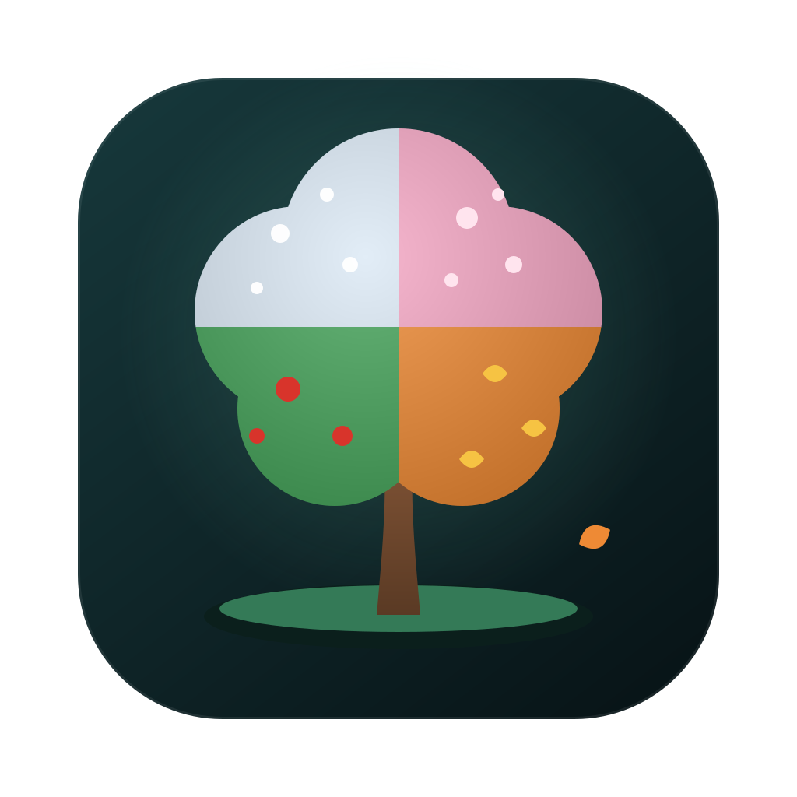

<p align="center">
  
</p>

# Clyro

**Mac care, made clear.**

Clyro ist ein nativer, lokaler macOS-Systemmonitor und vorsichtiger Cleaner. Das Projekt ist von der Klarheit moderner Mac-Werkzeuge inspiriert, hat aber ein eigenes visuelles System und setzt auf verständliche Erklärungen statt auf mysteriöse „Optimierung“.


## Neu: Werkzeugkasten

Clyro deckt jetzt den kompletten Funktionsumfang klassischer Mac-Pflegewerkzeuge ab (Status, Clean, Uninstall, Optimize, Analyze, Purge, Installer) – mit eigenem Look und Clyro-Artefakten:

- **Optimieren:** sichere Wartungsschritte (Quick-Look-Cache, DNS-Cache, Spotlight-Status, Dock/Finder neu starten) mit **Vorschau-Modus** (Trockenlauf, standardmäßig an)
- **Projekte:** findet `node_modules`, Rust `target`, Swift `.build`, `Pods` und `dist`/`build` in deinen Projektordnern; nur Projektordner mit passender Projektdatei, ältere Ordner vorausgewählt, alles in den Papierkorb
- **Gründlich deinstallieren:** Apps-Liste mit Papierkorb-Button, findet Rückstände in `~/Library` (Einstellungen, Caches, Container, Launch Agents …), Auswahl je Rückstand, macOS-eigene und laufende Apps sind geschützt
- Projekt- und Deinstallations-Aktionen erscheinen im Verlauf

- Live-Dashboard für CPU, RAM, Speicher, Netzwerk, Akku und Laufzeit
- animierte Verlaufsdiagramme
- verständlicher Mac-Gesundheitswert
- Liste der Prozesse mit höchster CPU-Auslastung
- „Clyro Crew“ mit echten App-Icons, Rollen-Emojis und verständlichen Prozessbeschreibungen
- eigene Prozessübersicht mit Suche, Rollenfiltern sowie CPU- und RAM-Sortierung
- Speicherfinder für große Dateien in Downloads, Schreibtisch, Dokumente und Filme
- sichere Schnellaktionen für Downloads, Aktivitätsanzeige, Speicher und Programme
- kompakte, schwebende Navigation am oberen Fensterrand statt einer breiten Sidebar
- vollständig sichtbare Statusübersicht ohne Scrollen mit kompaktem Bento-Raster
- platzsparende Prozessliste mit App-Icons, Rollen, RAM und CPU
- eigene Farbstimmung und animierter Hintergrund für jeden Bereich
- schwebende Clyro-Artefakte statt übernommener Planetenmotive
- neue visuelle Speicherlandschaft für die größten gefundenen Dateien
- App-Bibliothek mit Suche, Sortierung, Gesamtgröße und Finder-Verknüpfung
- Autostart-Auswertung nach Benutzer-, gemeinsamem und Systembereich
- lokaler Bereinigungsverlauf als visuelle Zeitleiste
- neu aufgebaute Bereinigungsansicht mit sicherer Auswahl und Ergebnisübersicht
- ruhigeres, systemnahes Kartendesign mit gezielt eingesetzten Rollen-Emojis
- Scan nach alten App-Caches, Protokollen, Installationsdateien, Xcode-Daten und Paket-Caches (npm, pip, Gradle)
- Whitelist in den Einstellungen: geschützte Einträge werden nie zum Bereinigen vorgeschlagen
- Auswahl und Bestätigung vor jeder Bereinigung
- Dateien werden in den Papierkorb verschoben statt endgültig gelöscht
- Übersicht installierter Apps und ihrer Bundle-Größe
- Anzeige von Launch Agents und Launch Daemons
- lokaler Bereinigungsverlauf
- keine Cloud, kein Konto und kein Tracking
- automatischer macOS-Buildcheck bei Änderungen auf GitHub

## Starten

Voraussetzungen:

- Mac mit macOS 14 oder neuer
- Xcode 15 oder neuer

1. Repository oder ZIP herunterladen und entpacken.
2. **`Clyro.xcodeproj` öffnen** – nicht einzelne Swift-Dateien.
3. Oben als Scheme **Clyro** und als Ziel **My Mac** auswählen.
4. Mit `⌘R` starten.

Die korrigierte Version ist ein echtes macOS-App-Projekt mit der Bundle-ID `dev.meb99.Clyro`. Dadurch kann macOS die App korrekt bei seinen Diensten registrieren; insbesondere tritt die Warnung `missing main bundle identifier` nicht mehr durch einen Swift-Package-Start auf.

Build 3 liest CPU, Arbeitsspeicher, Laufwerke, Netzwerk, Batterie und Prozesse direkt über native macOS-Schnittstellen aus. Externe Terminal-Kommandos sind für das Dashboard nicht mehr erforderlich. Außerdem verwendet Clyro wieder eine normale macOS-Titelleiste und begrenzt die Breite des Dashboards, damit die Oberfläche auch im Vollbild nicht auseinandergezogen wird.

Zum lokalen Ausprobieren ist kein kostenpflichtiger Apple-Developer-Account nötig.

## Sicherheitsprinzip

Clyro zeigt zuerst, was gefunden wurde. Nur ausdrücklich ausgewählte Elemente werden nach einer zweiten Bestätigung in den macOS-Papierkorb verschoben. Trotzdem handelt es sich um eine frühe Entwicklungsversion: Vor Tests mit wichtigen Daten sollte ein aktuelles Backup vorhanden sein.

Die erste Version scannt nur klar definierte Benutzerordner:

- `~/Library/Caches`
- `~/Library/Logs`
- `~/Downloads` für ältere `.dmg`, `.pkg` und `.zip`
- `~/Library/Developer/Xcode/DerivedData`

## Architektur

```text
Clyro.xcodeproj          Echtes macOS-App-Target und Bundle-ID
Info.plist               App-Metadaten
Sources/Clyro
├── ClyroApp.swift       App-Einstieg
├── Models.swift         Datenmodelle
├── Theme.swift          Farben, Typografie und Formatierung
├── SystemMonitor.swift  Live-Systemwerte
├── CleanupScanner.swift Sicherer Dateiscan und Papierkorb
├── Components.swift     Wiederverwendbare UI-Komponenten
├── RootView.swift       Navigation und Sidebar
├── DashboardView.swift  Systemübersicht
└── FeatureViews.swift   Cleaner, Apps, Autostart, Verlauf, Einstellungen
```

## Nächste Schritte

- App-Daten pro Anwendung zusammenführen
- sichere App-Deinstallation mit vollständiger Vorschau
- Hintergrundelemente aktivieren und deaktivieren
- bessere Speicheranalyse
- App-Icon, Onboarding und signierte DMG-Version
- Unit-Tests für Parser und Cleaner-Regeln

## Hinweis

Clyro ist ein eigenständiges Lern- und Open-Source-Projekt. Namen, Quellcode, Icons und Marken anderer Apps werden nicht übernommen.

## Lizenz

MIT
